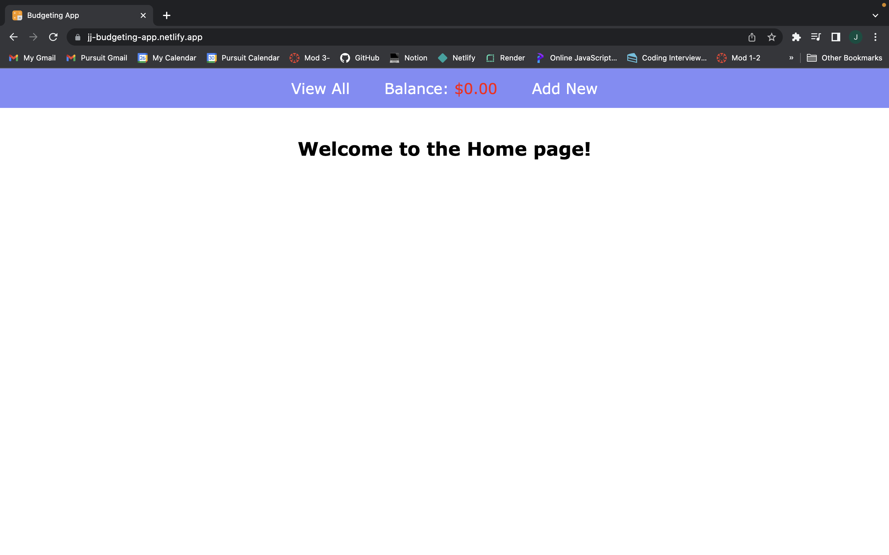
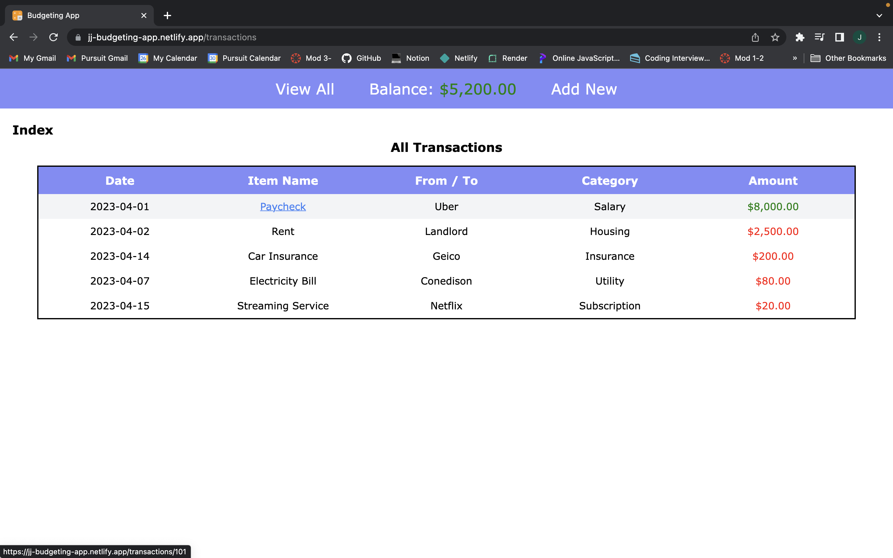
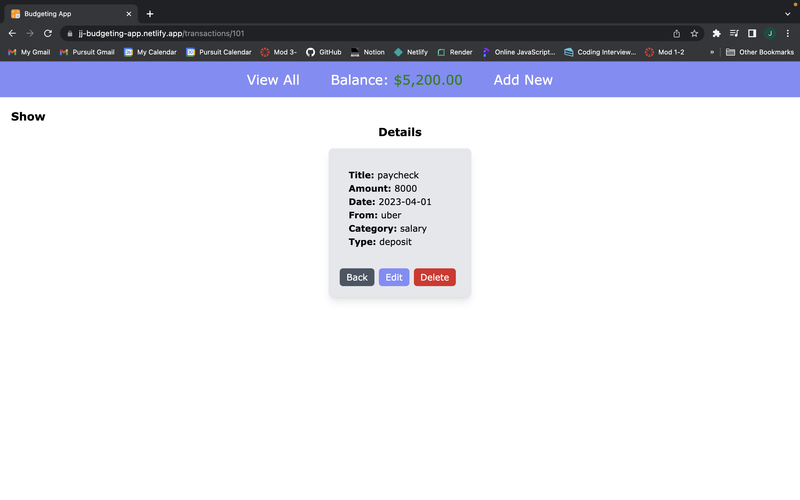
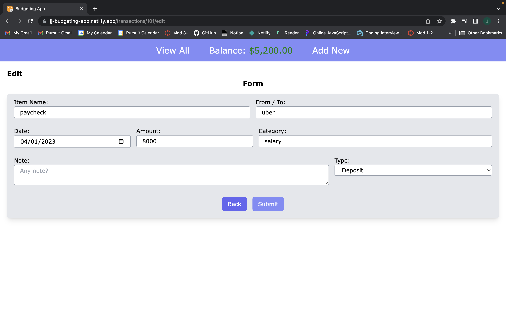
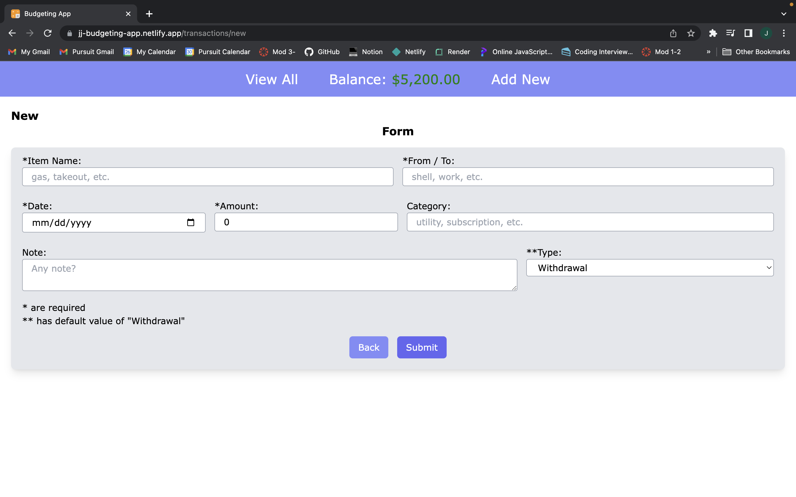
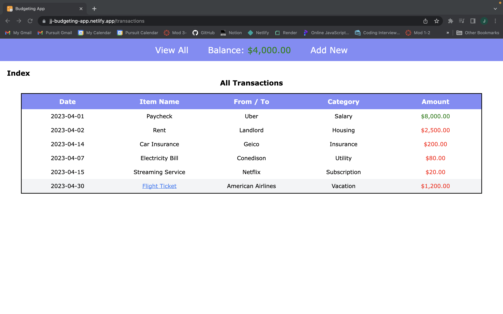

# Budgeting App Project (Full Stack)
Pursuit 9.4 Module 4 - Budgeting App Project (Frontend & Backend)

- [Frontend Repo](https://github.com/pjungjs/budgeting-app-frontend)
- [Backend Repo](https://github.com/pjungjs/budgeting-app-backend)
- Project plan: [Trello](https://trello.com/b/vKAxNop2/project-budgeting-app)
- Pursuit [Project Guide](https://github.com/9-4-pursuit/project-budgeting-app)

---

### Deployment

- [Frontend](https://jj-budgeting-app.netlify.app) deployed on Netlify
- [Backend](https://budgeting-app-backend-a9ie.onrender.com) deployed on Render 

---

### Features

- Display a list of the all the transactions.
- View transaction details.
- Add, edit, and delete transactions.
- Display the total balance available on the Navigation bar.
- Change color depending on the amount and the balance.

---

### Technologies Used

* JavaScript
* React
* Express JS
* Tailwind CSS
* NPM (axios, react-router-dom, CORS, nodemon, dotenv)

---

### Example application

- Home page

- Index page (all transactions)

- Details of a transaction

- Edit a specific transaction

- To add a new transaction

- Index page after adding a new transaction

